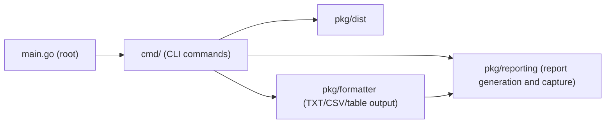
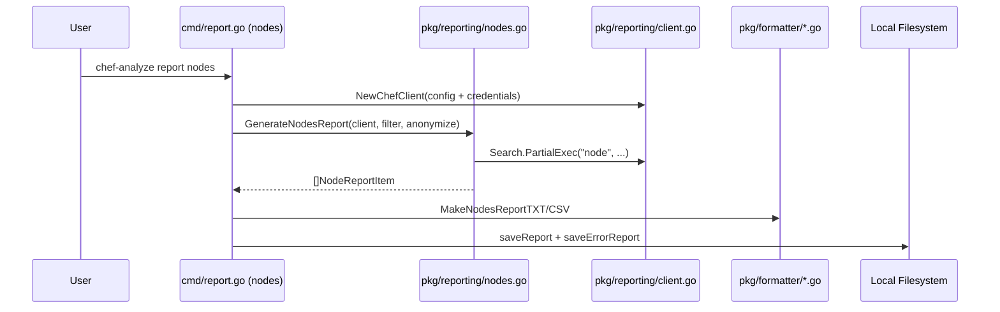
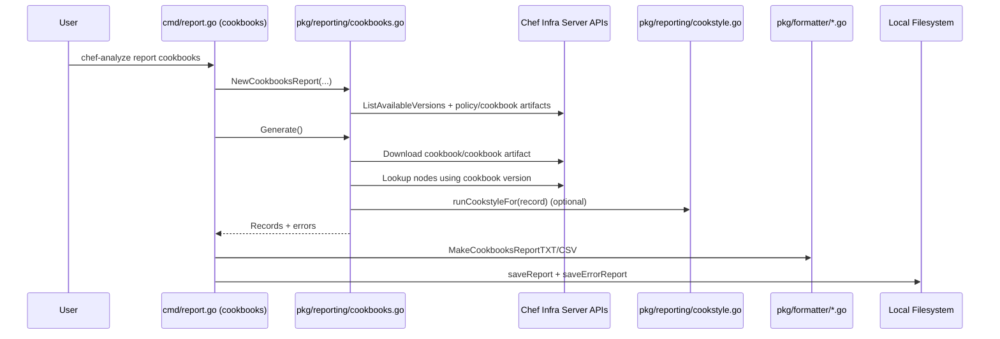
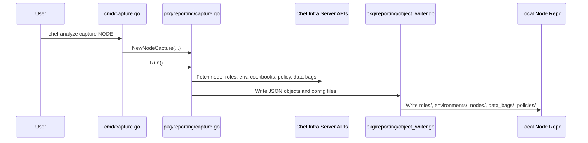

# Design
This document describes the current and future shape of this tool, it will
be a place for us, at Chef, to discuss about the design and usability, the
flow of commands that we expect user to follow plus, we will start the
documentation of this tool in an early stage.

## Architecture

The architecture map below uses real repository paths so each node maps to
code that exists in this project.

<!-- BEGIN AUTO-GENERATED:ARCHITECTURE -->

<!-- END AUTO-GENERATED:ARCHITECTURE -->

## Subsystem Documentation

- Command routing and top-level argument classification:
  [docs/SUBSYSTEM_CMD_ROUTING.md](SUBSYSTEM_CMD_ROUTING.md)

### Extension and Risk Notes

When extending top-level CLI behavior in `cmd/`, keep argument
classification logic in `cmd/argv.go`, keep root wrappers in `cmd/root.go`
thin, and update subsystem docs in the same PR.

Known risks in this area include accidental broadening of top-level help
detection and behavior/docs drift when command semantics change without
documentation updates.

### Data Flows

1. Nodes report flow



2. Cookbooks report flow



3. Capture command flow



## Help Documentation

### Main help
```bash
$ chef-analyze help
Analyze your Chef Infra Server artifacts to understand the effort to upgrade
your infrastructure by generating reports, automatically fixing violations
and/or deprecations, and generating Effortless packages.

Usage:
  chef-analyze [command]

Available Commands:
  help        Help about any command
  report      Generate reports from a Chef Infra Server

Flags:
  -s, --chef_server_url string   Chef Infra Server URL
  -k, --client_key string        Chef Infra Server API client key
  -n, --client_name string       Chef Infra Server API client username
  -c, --credentials string       Chef credentials file (default $HOME/.chef/credentials)
  -h, --help                     help for chef-analyze
  -o, --ssl-no-verify            Disable SSL certificate verification
  -p, --profile string           Chef Infra Server URL (default "default")

Use "chef-analyze [command] --help" for more information about a command.
$
```
### `report` sub-command help
```
$ chef-analyze report --help
Generate reports from a Chef Infra Server

Usage:
  chef-analyze report [command]

Available Commands:
  cookbooks   Generates a cookbook oriented report
  nodes       Generates a nodes oriented report

Flags:
  -h, --help   help for report

Global Flags:
  -s, --chef_server_url string   Chef Infra Server URL
  -k, --client_key string        Chef Infra Server API client key
  -n, --client_name string       Chef Infra Server API client username
  -c, --credentials string       Chef credentials file (default $HOME/.chef/credentials)
  -o, --ssl-no-verify            Disable SSL certificate verification
  -p, --profile string           Chef Infra Server URL (default "default")

Use "chef-analyze report [command] --help" for more information about a command.
$
```

## Tasks
### Creating reports for cookbooks
```
$ chef-analyze report cookbooks
$ chef-analyze report cookbooks foo
```

### Creating reports for nodes
```
$ chef-analyze report nodes
$ chef-analyze report nodes bar
```

### Filters: all nodes in an environment
```
$ chef-analyze report node all --environment qa
```
